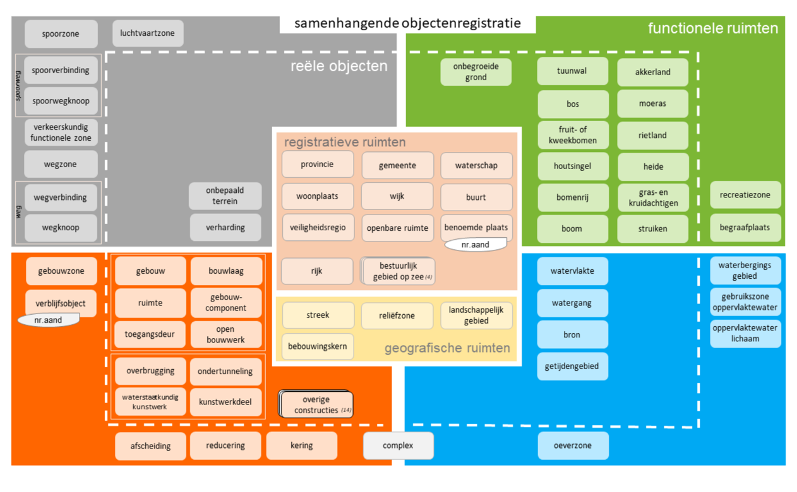

# Inhoudelijke keuzes op hoofdlijnen

Hieronder worden een aantal inhoudelijke keuzes op hoofdlijnen opgesomd ten
behoeve van de informatiemodellering voor de IBRO. Samen vormen deze keuzes de scope van het informatiemodel.

## Aanpak
Het IBRO informatiemodel wordt gebaseerd op de eisen aan het conceptueel informatiemodel dat is ontwikkeld voor de Samenhangende Objectenregistratie (SOR) [[EMSO]]. Alleen daar waar voortschrijdend inzicht bestaat over de gewenste inhoud, overweegt de werkgroep om af te wijken van dit model. 

De eerste versie van het informatiemodel IBRO moet eind eind Q2​ gereed zijn, inclusief consultatie van het conceptueel informatiemodel en verwerking van de reacties. De consultatie moet dan medio mei 2025​ plaatsvinden om eind Q1 gereed te zijn. Dit is een consultatie van begrippen en conceptueel informatiemodel​. Dit komt neer op circa 3 maanden doorlooptijd voor het maken van​:
- Begrippenmodel​
- Conceptueel informatiemodel​
Tevens wordt gewerkt aan:
- Logisch informatiemodel​
- Technisch model + aanverwanten​

Tijdens de consultatie kan wel parallel doorgewerkt worden aan logisch informatiemodel en technisch model​.

De werkgroep informatiemodel IBRO heeft gezamenlijk een prioritering op hoofdlijnen bepaald voor de inhoud. Gestart wordt met de onderwerpen waar het minst voortschrijdend inzicht wordt verwacht, gevolgd door onderwerpen waar dit wel bestaat. 

## Afbakening

Figuur 1 toont de scope van de IBRO: 

<figure>
    
    <figcaption>Inhoud van de SOR</figcaption>
</figure>

De SOR, zoals beschreven in de Eisen aan model samenhangende objectenregistratie [[EMSO]] (juni 2021), vormt in principe de scope van de IBRO. Het informatiemodel IBRO wordt op basis van dit DiS Geo eisen document ontwikkeld. Voortschrijdend inzicht over de inhoud dat is ontstaan sinds die tijd wordt meegenomen in de ontwikkeling van het informatiemodel voor de IBRO. 

<aside class="issue">De Basisregistratie Topografie maakt ook onderdeel uit van de SOR, maar wordt niet genoemd in de context van de scope van IBRO. Is de BRT binnen of buiten scope? Wel of niet opnemen in het informatiemodel?</aside>

## Inhoud en prioritering

De volgende onderdelen die in het EMSO beschreven zijn vormen onderdeel van de scope van IBRO: 
1. Water​
1. Groen​
1. Registratieve ruimten​
1. Wegen ​
    1. fysiek​
    1. functioneel (netwerkregistratie)​
1. Gebouwen​

 Deze volgorde heeft de werkgroep gekozen op basis van de mate van voortschrijdend inzicht dat na de ontwikkeling van de EMSO heeft plaatsgevonden. Op het gebied van de eerste paar onderwerpen is weinig voortschrijdend inzicht bekend en daarom kan de informatiemodellering daarvan vlot voltooid worden, terwijl er nog overleg plaatsvindt rond de andere onderwerpen (met name wegen en gebouwen) waar wel voortschrijdend inzicht verwerkt moet worden.

Van deze objecten worden eigenschappen opgenomen zoals beschreven in de Eisen aan model samenhangende objectenregistratie [[EMSO]]. 

Wat betreft de geometrie, is het streefbeeld om een 3D-weergave van de objecten op te nemen. Per object zal op basis van de toepassingsmogelijkheden en gebruikswensen besloten moeten worden of het object in 3D vastgelegd moet en kan worden.

Door het het Nationaal toegangspunt Mobilitieteitsdata (NTM) wordt in opdracht van het ministerie van I&W gewerkt aan een gegevenscatalogus mobiliteitsdata. Hier is een netwerkregistratie een belangrijk fundament.  Afstemming met dit traject creëert een Win-Win-sitaute en voorkomt dubbele ontwikkeling.

## Buiten scope

De volgende inhoud is buiten scope geplaatst: 
- Bestuurlijke gebieden en bestuurlijke gebiede op zee: als onderdeel van registratieve ruimten ligt dit bij Kadaster.
- Van de WOZ komt alleen het WOZ-objectdeel erin. De rest van WOZ is buiten scope.
- Alle inhoud die niet in de Eisen aan model samenhangende objectenregistratie [[EMSO]] beschreven is. Niet-SOR gegevens kunnen eventueel later worden toegevoegd maar zijn in deze fase buiten scope.
- De IBRO is bedoeld als een registratie van basisgegevens. Aanvullende detailgegevens van objecten, zoals gegevens gericht op beheer en onderhoud van assets (BOR informatie) zijn buiten scope, behalve als ze nu al in de EMSO van de SOR zijn opgenomen.
